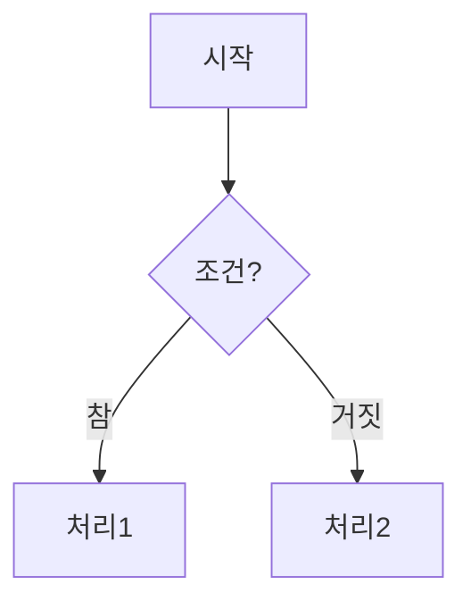

#
# 교육 환경 설정 및 간단한 파이썬 연습 코드
# [실습3] Mermaid 다이어그램
#
# 작성일 : 2026-07-14
# 작성자 : 김민솔, SKALA
#
# 변경일 : 
#
# All Rights Reserved by SK AX, SKALA
#

## Mermaid란?
* Mermaid는 텍스트 기반으로 다이어그램(순서도, 시퀀스 다이어그램, 클래스 다이어그램 등)을 그릴 수 있는 문법이자 도구입니다. 이미지 편집 툴 없이 코드처럼 작성하면 자동으로 그림으로 렌더링됩니다.

* Markdown 파일(GitHub, Notion 등), 문서 도구, 이 대화의 Artifact 기능 등 여러 곳에서 별도 그리기 도구 없이 코드만으로 그림이 그려집니다.
* 지원하는 종류: flowchart(순서도), sequenceDiagram(시퀀스), classDiagram, erDiagram(ER 다이어그램), gantt(간트차트), stateDiagram 등 다양합니다.
* 코드로 관리되기 때문에 git으로 버전 관리하기 쉽고, 텍스트만 수정하면 다이어그램이 자동으로 바뀝니다.

## Mermaid로 그릴 수 있는 다이어그램 종류

| 종류 | 키워드 | 용도 |
|---|---|---|
| Flowchart (순서도) | `flowchart` | 프로세스 흐름, 알고리즘, 의사결정 |
| Sequence Diagram (시퀀스) | `sequenceDiagram` | 객체/시스템 간 메시지 주고받는 순서 |
| Class Diagram (클래스) | `classDiagram` | 클래스 구조, 상속·연관 관계 |
| State Diagram (상태) | `stateDiagram-v2` | 상태 전이(state machine) |
| ER Diagram (개체-관계) | `erDiagram` | 데이터베이스 테이블 관계 설계 |
| Gantt Chart (간트차트) | `gantt` | 프로젝트 일정 관리 |
| Pie Chart (파이차트) | `pie` | 비율/구성 데이터 |
| User Journey (사용자 여정) | `journey` | 사용자 경험 단계별 만족도 |
| Git Graph | `gitGraph` | 브랜치/커밋 히스토리 시각화 |
| Mindmap (마인드맵) | `mindmap` | 아이디어 계층 구조 정리 |
| Timeline (타임라인) | `timeline` | 시간순 이벤트 나열 |
| Quadrant Chart (사분면) | `quadrantChart` | 2축 기준 항목 분류 |
| Sankey Diagram | `sankey-beta` | 흐름/양의 이동 시각화 |

예제
1. Flowchart (순서도)

